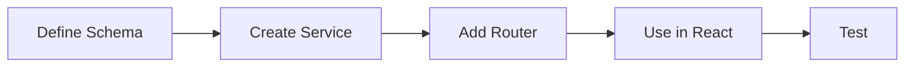

# Development Guide

This guide covers common development tasks and best practices for working with the Fastify + tRPC + React monorepo.

## Table of Contents

1. [Getting Started](#getting-started)
2. [Development Workflow](#development-workflow)
3. [Adding New Features](#adding-new-features)
4. [Type Safety Best Practices](#type-safety-best-practices)
5. [Testing](#testing)
6. [Debugging](#debugging)
7. [Performance Optimization](#performance-optimization)
8. [Common Patterns](#common-patterns)

## Getting Started

### Prerequisites

- Node.js 18+ 
- npm 8+
- TypeScript knowledge
- React knowledge

### Initial Setup

```bash
# Clone the repository
git clone <your-repo-url>
cd my-workspace

# Install all dependencies
npm install

# Start development servers
npm run dev:server  # Terminal 1
npm run dev:webapp  # Terminal 2
```

### IDE Setup

**Recommended: VS Code** with these extensions:
- ESLint
- Prettier
- TypeScript and JavaScript Language Features
- ES7+ React/Redux/React-Native snippets

**Settings** (.vscode/settings.json):
```json
{
  "typescript.tsdk": "node_modules/typescript/lib",
  "typescript.enablePromptUseWorkspaceTsdk": true,
  "editor.formatOnSave": true,
  "editor.codeActionsOnSave": {
    "source.fixAll.eslint": true
  }
}
```

## Development Workflow

### 1. Feature Development Flow



### 2. Making Changes

#### Backend Changes
1. **Schema First**: Define or update Zod schemas in `shared/src/schemas/`
2. **Service Layer**: Implement business logic in `server/src/services/`
3. **Router**: Expose via tRPC in `server/src/trpc/routers/`
4. **Test**: Verify with API calls

#### Frontend Changes
1. **Use Hooks**: Leverage tRPC hooks in components
2. **Handle States**: Loading, error, and success states
3. **Optimize**: Use React Query features for caching

### 3. Hot Reloading

Both frontend and backend support hot reloading:
- **Frontend**: Vite provides instant HMR
- **Backend**: tsx watch mode restarts on changes

## Adding New Features

### Example: Adding a Post Feature

#### 1. Create Schema (shared/src/schemas/post.schema.ts)
```typescript
import { z } from 'zod';

export const postSchema = z.object({
  id: z.string().uuid(),
  title: z.string().min(1).max(200),
  content: z.string().min(1),
  authorId: z.string().uuid(),
  createdAt: z.date(),
  updatedAt: z.date(),
});

export const createPostSchema = postSchema.omit({
  id: true,
  createdAt: true,
  updatedAt: true,
});

export type Post = z.infer<typeof postSchema>;
export type CreatePost = z.infer<typeof createPostSchema>;
```

#### 2. Create Service (server/src/services/post.service.ts)
```typescript
import { Post, CreatePost } from '@workspace/shared';
import crypto from 'crypto';

class PostService {
  private posts = new Map<string, Post>();

  async create(data: CreatePost): Promise<Post> {
    const post: Post = {
      ...data,
      id: crypto.randomUUID(),
      createdAt: new Date(),
      updatedAt: new Date(),
    };
    
    this.posts.set(post.id, post);
    return post;
  }

  async findAll() {
    return Array.from(this.posts.values());
  }
}

export const postService = new PostService();
```

#### 3. Create Router (server/src/trpc/routers/post.router.ts)
```typescript
import { router, publicProcedure } from '../trpc.js';
import { createPostSchema } from '@workspace/shared';
import { postService } from '../../services/post.service.js';

export const postRouter = router({
  create: publicProcedure
    .input(createPostSchema)
    .mutation(async ({ input }) => {
      return postService.create(input);
    }),
    
  list: publicProcedure
    .query(async () => {
      return postService.findAll();
    }),
});
```

#### 4. Add to App Router
```typescript
// server/src/trpc/routers/app.router.ts
export const appRouter = router({
  users: userRouter,
  posts: postRouter, // Add this line
});
```

#### 5. Use in React
```typescript
function PostList() {
  const { data: posts } = trpc.posts.list.useQuery();
  const createPost = trpc.posts.create.useMutation();

  return (
    <div>
      {posts?.map(post => (
        <article key={post.id}>
          <h2>{post.title}</h2>
          <p>{post.content}</p>
        </article>
      ))}
    </div>
  );
}
```

## Type Safety Best Practices

### 1. Always Use Zod Schemas
```typescript
// ✅ Good - Single source of truth
const userSchema = z.object({
  email: z.string().email(),
  name: z.string(),
});

// ❌ Bad - Duplicate type definition
interface User {
  email: string;
  name: string;
}
```

### 2. Leverage Type Inference
```typescript
// ✅ Good - Let TypeScript infer
export type User = z.infer<typeof userSchema>;

// ❌ Bad - Manual type definition
export type User = {
  email: string;
  name: string;
};
```

### 3. Use Proper Error Handling
```typescript
// ✅ Good - Type-safe error handling
const { data, error } = trpc.users.list.useQuery();
if (error) {
  if (error.data?.code === 'NOT_FOUND') {
    // Handle specific error
  }
}

// ❌ Bad - Generic error handling
try {
  // ...
} catch (e) {
  console.error(e);
}
```

## Testing

### Unit Testing Services
```typescript
// server/src/services/__tests__/user.service.test.ts
import { userService } from '../user.service';

describe('UserService', () => {
  it('should create a user', async () => {
    const user = await userService.create({
      email: 'test@example.com',
      name: 'Test User',
    });
    
    expect(user.id).toBeDefined();
    expect(user.email).toBe('test@example.com');
  });
});
```

### Integration Testing tRPC
```typescript
// server/src/trpc/routers/__tests__/user.router.test.ts
import { createCaller } from '../app.router';

const caller = createCaller({});

describe('User Router', () => {
  it('should list users', async () => {
    const result = await caller.users.list({ limit: 10 });
    expect(result.items).toBeInstanceOf(Array);
  });
});
```

### E2E Testing with Playwright
```typescript
// e2e/users.spec.ts
test('should create a user', async ({ page }) => {
  await page.goto('http://localhost:5173');
  await page.fill('[placeholder="Name"]', 'John Doe');
  await page.fill('[placeholder="Email"]', 'john@example.com');
  await page.click('button:has-text("Create User")');
  
  await expect(page.locator('text=John Doe')).toBeVisible();
});
```

## Debugging

### Backend Debugging

1. **Console Logging**:
```typescript
// Add to procedures for debugging
.query(async ({ input, ctx }) => {
  console.log('Query input:', input);
  console.log('Context:', ctx);
  // ... rest of logic
});
```

2. **VS Code Debugging**:
```json
// .vscode/launch.json
{
  "type": "node",
  "request": "launch",
  "name": "Debug Server",
  "program": "${workspaceFolder}/server/src/index.ts",
  "runtimeExecutable": "tsx",
  "console": "integratedTerminal"
}
```

### Frontend Debugging

1. **React DevTools**: Install browser extension
2. **React Query DevTools**:
```typescript
// Add to main.tsx
import { ReactQueryDevtools } from '@tanstack/react-query-devtools';

// In your app
<ReactQueryDevtools initialIsOpen={false} />
```

## Performance Optimization

### Backend Optimization

1. **Database Connection Pooling** (when you add a database):
```typescript
// Use connection pooling
const pool = new Pool({
  max: 20,
  idleTimeoutMillis: 30000,
});
```

2. **Caching**:
```typescript
// Add caching to services
const cache = new Map();

async findById(id: string) {
  if (cache.has(id)) {
    return cache.get(id);
  }
  const user = await db.user.findById(id);
  cache.set(id, user);
  return user;
}
```

### Frontend Optimization

1. **Query Optimization**:
```typescript
// Configure stale time
const { data } = trpc.users.list.useQuery(
  { limit: 10 },
  {
    staleTime: 5 * 60 * 1000, // 5 minutes
    cacheTime: 10 * 60 * 1000, // 10 minutes
  }
);
```

2. **Optimistic Updates**:
```typescript
const utils = trpc.useContext();
const createUser = trpc.users.create.useMutation({
  onMutate: async (newUser) => {
    await utils.users.list.cancel();
    const previousUsers = utils.users.list.getData();
    
    utils.users.list.setData(old => ({
      ...old,
      items: [...old.items, newUser],
    }));
    
    return { previousUsers };
  },
  onError: (err, newUser, context) => {
    utils.users.list.setData(context.previousUsers);
  },
});
```

## Common Patterns

### Authentication Context
```typescript
// server/src/trpc/context.ts
export async function createContext({ req }: CreateFastifyContextOptions) {
  const token = req.headers.authorization?.replace('Bearer ', '');
  const user = token ? await validateToken(token) : null;
  
  return { user };
}

// Protected procedure
export const protectedProcedure = publicProcedure.use(
  middleware(({ ctx, next }) => {
    if (!ctx.user) {
      throw new TRPCError({ code: 'UNAUTHORIZED' });
    }
    return next({ ctx: { user: ctx.user } });
  })
);
```

### File Uploads
```typescript
// Use multipart form data with Fastify
import multipart from '@fastify/multipart';

server.register(multipart);

// In a regular Fastify route (not tRPC)
server.post('/upload', async (request) => {
  const data = await request.file();
  // Process file
});
```

### Real-time Updates
```typescript
// Add WebSocket support
import { createWSClient, wsLink } from '@trpc/client/links/wsLink';

// In tRPC client setup
const wsClient = createWSClient({
  url: 'ws://localhost:3001',
});

const trpcClient = createTRPCClient({
  links: [
    wsLink({ client: wsClient }),
  ],
});
```

### Error Monitoring
```typescript
// Add error tracking
import * as Sentry from '@sentry/node';

// In tRPC error handler
onError({ error, type, path }) {
  if (error.code === 'INTERNAL_SERVER_ERROR') {
    Sentry.captureException(error);
  }
}
```

## Tips and Tricks

1. **Use Path Aliases**:
```typescript
// tsconfig.json
{
  "compilerOptions": {
    "paths": {
      "@/*": ["./src/*"]
    }
  }
}
```

2. **Environment Variables**:
```typescript
// Use dotenv for local development
import dotenv from 'dotenv';
dotenv.config();

// Type-safe env vars
const env = z.object({
  PORT: z.string().transform(Number),
  DATABASE_URL: z.string(),
}).parse(process.env);
```

3. **Git Hooks**:
```json
// package.json
{
  "husky": {
    "hooks": {
      "pre-commit": "npm run lint && npm run typecheck"
    }
  }
}
```

## Troubleshooting

### Common Issues

1. **Type errors after schema changes**:
   - Restart TypeScript server in VS Code
   - Run `npm run typecheck` to see all errors

2. **CORS errors**:
   - Check server CORS configuration
   - Ensure frontend URL is whitelisted

3. **Module not found errors**:
   - Run `npm install` at root
   - Check if using correct import paths (.js extensions)

4. **React Query not updating**:
   - Check if mutations are invalidating queries
   - Verify staleTime and cacheTime settings